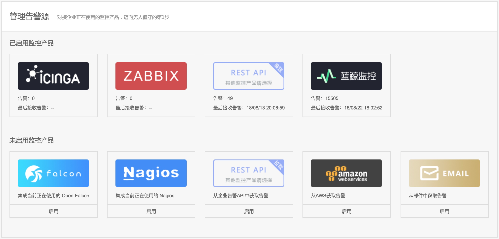

## 故障自愈集成告警源

故障自愈默认集成的监控产品有`蓝鲸监控`、`Zabbix`、`OpenFalcon`，`Nagios`、`Icinga`，如果你的监控产品不在上述之列，请使用`REST API推送`或`REST API拉取`的方式对接企业内部的监控系统.

> 注：对接监控产品的告警时，请先获取对应监控产品的运维权限。故障自愈本身不提供监控产品。
          故障自愈的腾讯云版本默认集成“腾讯云监控”.

图1. 故障自愈集成监控产品

### 第三方告警源集成指南
* [集成蓝鲸监控](Integrated_Bkmonitor.md)
* [集成Zabbix](Integrated_Zabbix.md)
* [集成Open-falcon](Integrated_Openfalcon.md)
* [集成Icinga2](GIntegrated_Icinga2.md)
* [集成Nagios](Integrated_Nagios.md)
* [集成REST API推送](Integrated_RestAPI_Push.md)
* [集成REST API拉取](Integrated_RestAPI_Pull.md)

