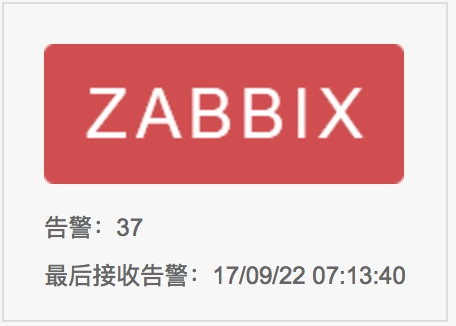
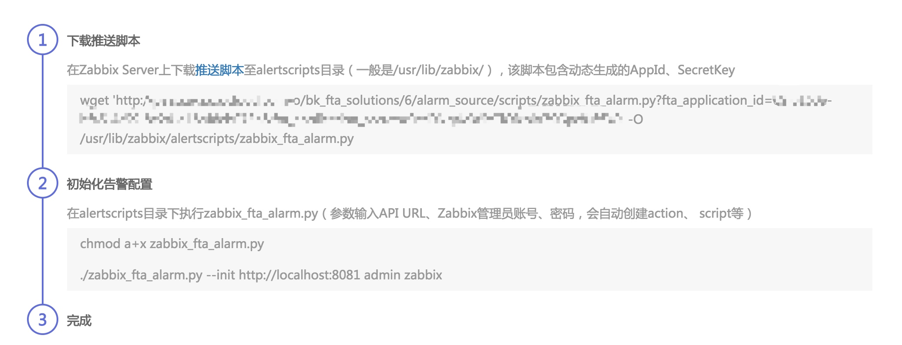
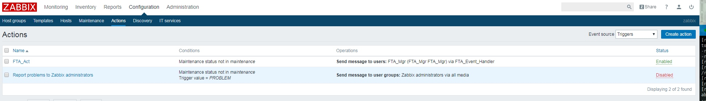
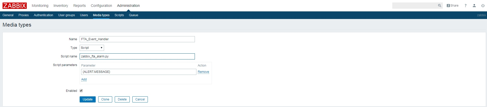
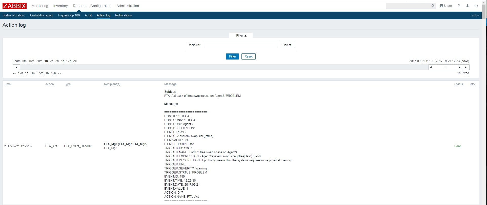
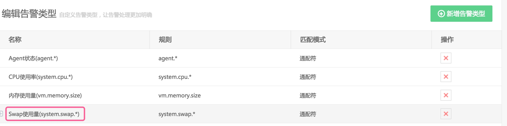
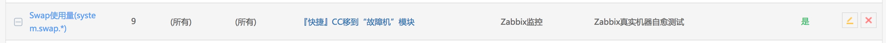
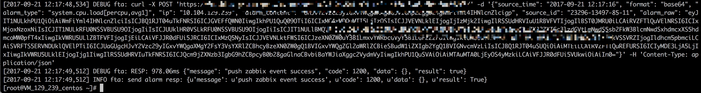
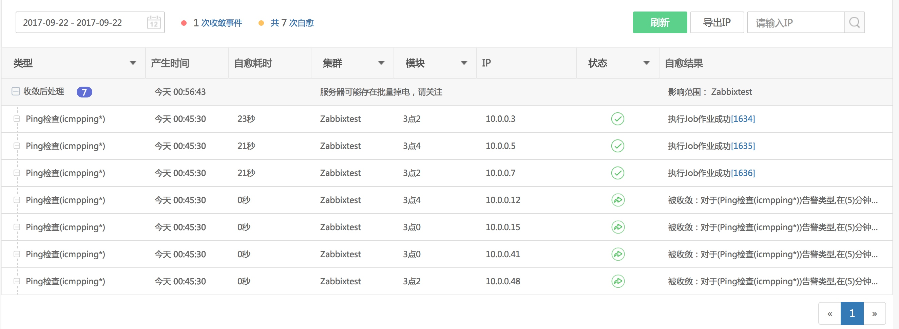

## 集成Zabbix

Zabbix通过推送的方式，将告警推动至故障自愈的告警接收API中。 

图1. 集成Zabbix统计数据展示

### 1. 运行初始化脚本

就这么简单！

### 2. Zabbix是如何发送消息给故障自愈的
执行了初始化脚本后，自愈会自动创建如下操作。

自动创建名为FTA_Act的Action

FTA_Act这个Action的Operation会通知FTA_Mgr用户，FTA_Mgr的通知媒介就是调用/usr/lib/zabbix/alertscripts/zabbix_fta_alarm.py 

告警产生后在Action log中可以看到发给FTA_Act的Message

### 3. 自愈集成Zabbix告警注意事项
自愈处理告警是把 {HOST.IP}作为故障主机IP，{ITEM.KEY}作为告警类型，请确保 {HOST.IP}在配置平台中注册，同时ITEM.KEY 能被你接入的告警类型所匹配。

上图的ITEM.KEY为 system.swap.size[,pfree]被下图的 Swap使用量(system.swap.*)的规则所匹配。

在/tmp/zabbix_fta_alarm.log 中可以查看到日志信息

### 4. Zabbix告警自愈历史

