## 自定义告警源接入扩展开发指引


### 1. WEB端开发流程
#### 1.1 给新接入的告警源命名

以下接入将以 **TEST-MONITOR** 作为告警源。

#### 1.2 添加告警源配置项 

配置文件路径：`${project_path}/fta_solutions_app/fta_std.py`

配置内容：以 **SOURCE_**开头的所有配置项
> **SOURCE\_TYPE\_CHOICES：** 告警源类型说明，用于DB记录和页面展示
> **SOURCE\_TYPE\_PAGES\_CHOICES：** 用于新增告警源页面  
> **SOURCE\_TYPE\_TIPS：** 告警源说明提示，用于告警源配置页面      
> **SOURCE\_TYPE\_MSG1：** 告警源管理页面未启用监控的说明文字     
> **SOURCE\_TYPE\_MSG2：** 接入告警源配置页面的说明

修改代码如下图：

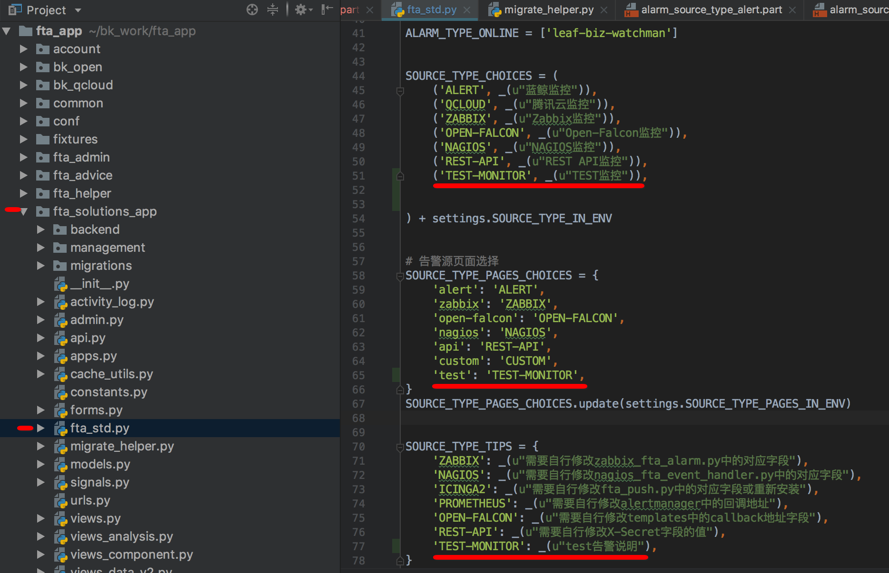

#### 1.3 页面配置告警类型

##### 1.3.1 添加修改告警源页面的模版
在路径`${project_path}/templates/fta_solutions/alarm_source`下添加对应的模版文件，可以开发自己需要的配置内容。

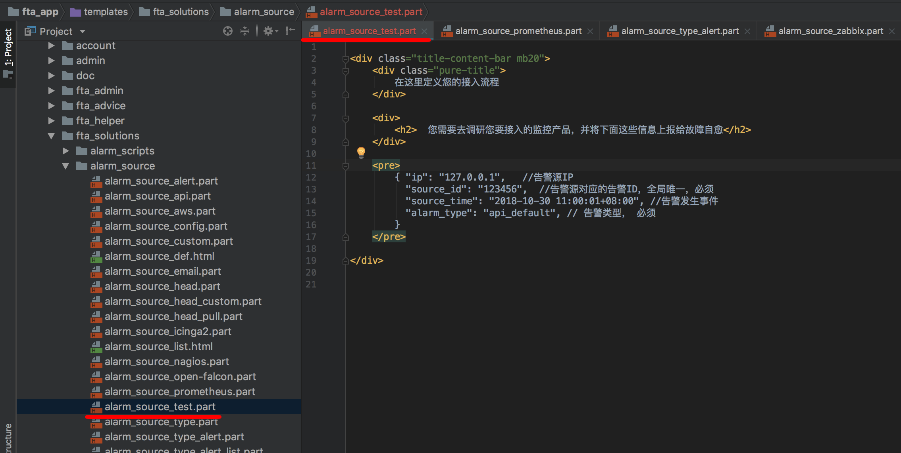

##### 1.3.2 自定义告警类型，让告警处理更加明确
在管理告警源中添加自定义类型, 规则匹配的内容为告警中的alarm_type字段

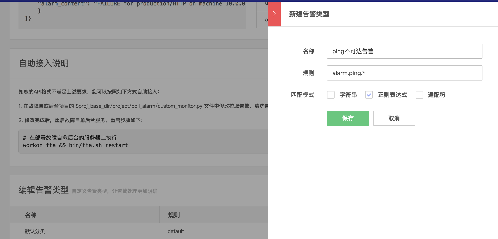

接入自愈的页面中可以选择自己配置的告警类型

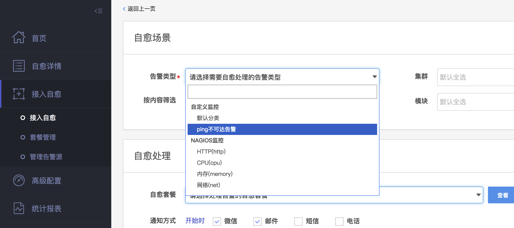

##### 1.3.3 代码初始化告警类型
如果告警类型脚都，也可以通过migrations或其他方式进行告警类型的初始化

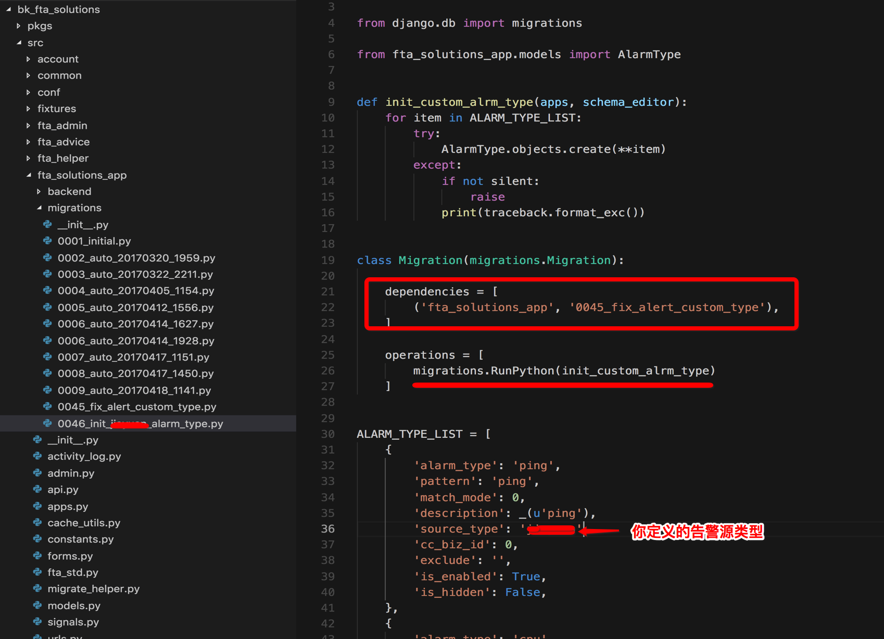

### 2. FTA后台开发流程

#### 2.1 推送类告警

##### 2.1.1 开发接收告警API接口
在目录`/fta/manager/www/apiservice/`下，添加对应的api文件，如下（可参考rest_api）：

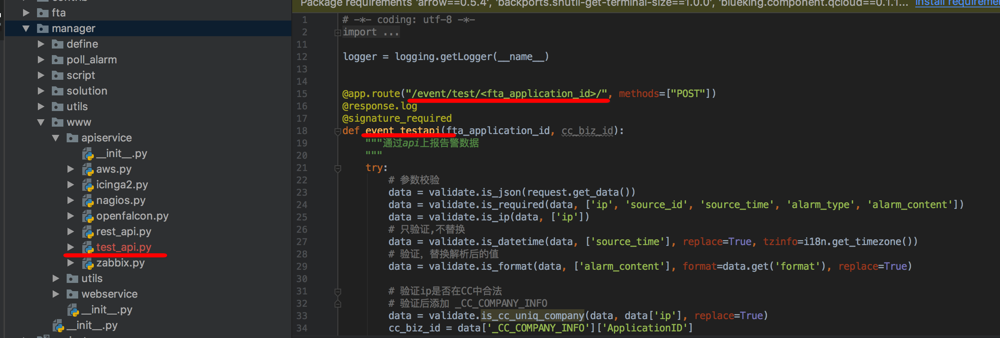

在这个页面中，注意根据告警源的配置的字段信息进行必要的配置，可参考 is\_required

##### 2.1.2 开发清洗数据代码
在目录`/fta/manager/poll_alarm/`添加文件，主要功能为清洗数据
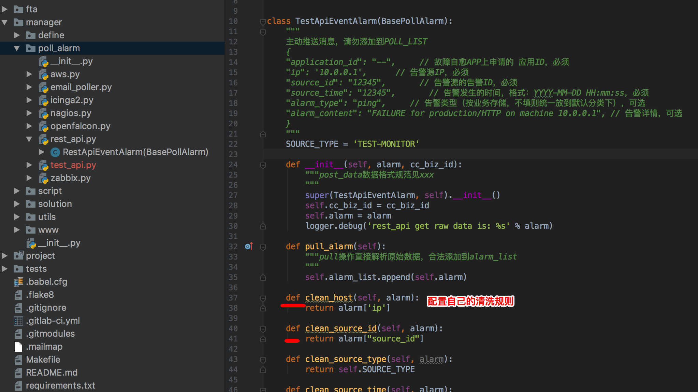


##### 2.1.3 验证
**首先**，在接入自愈页面，根据步骤 `1.3.2` 配置的告警接入一个通知套餐
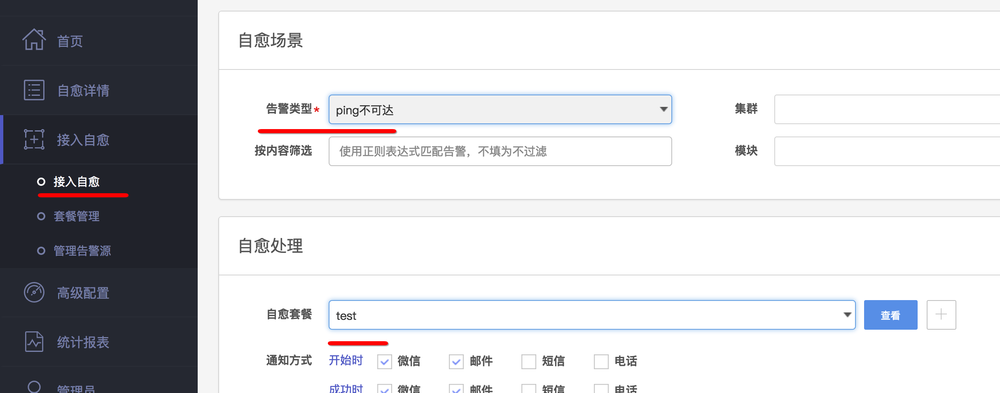

**然后**，模拟发出告警（根据自己的机器信息和告警类型修改对应的内容），如下图， 等待处理：
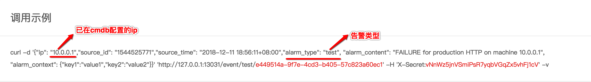

**最后**， 在自愈详情页面查看告警结果 

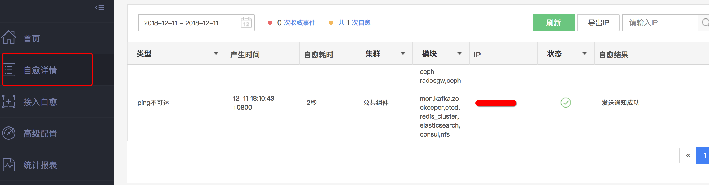

#### 2.2 拉取类告警

##### 2.2.1 开发拉取告警部分代码
在目录`project/poll_alarm/` 添加拉取告警和清洗数据的py文件，可以参考custom_monitor
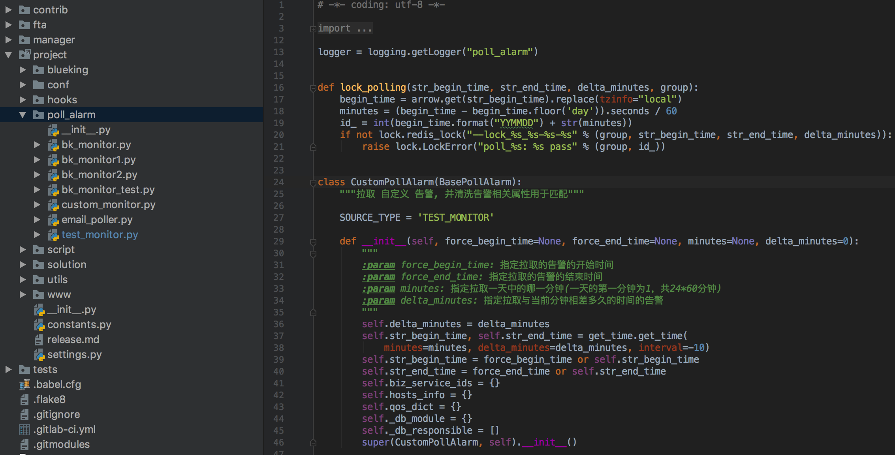

##### 2.2.2 配置拉取规则
在文件 `project/settings_env.py`配置参数 **POLL_INTERVAL** ，**POLL_LIST**，如下：

```python
POLL_INTERVAL = 1  # minutes
POLL_LIST = [
    # add your poll_alarm module here
    'bk_monitor',
    'bk_monitor1',
    'bk_monitor2',
    'custom_monitor',
    'test_monitor',    # 2.2.1 配置的内容拉取文件名
]
```


