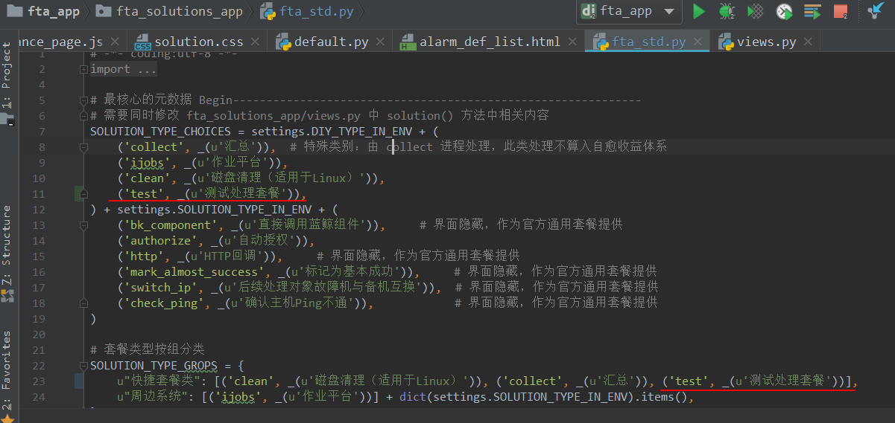
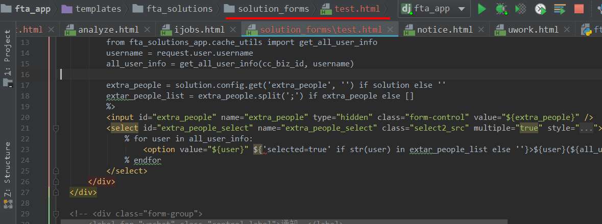
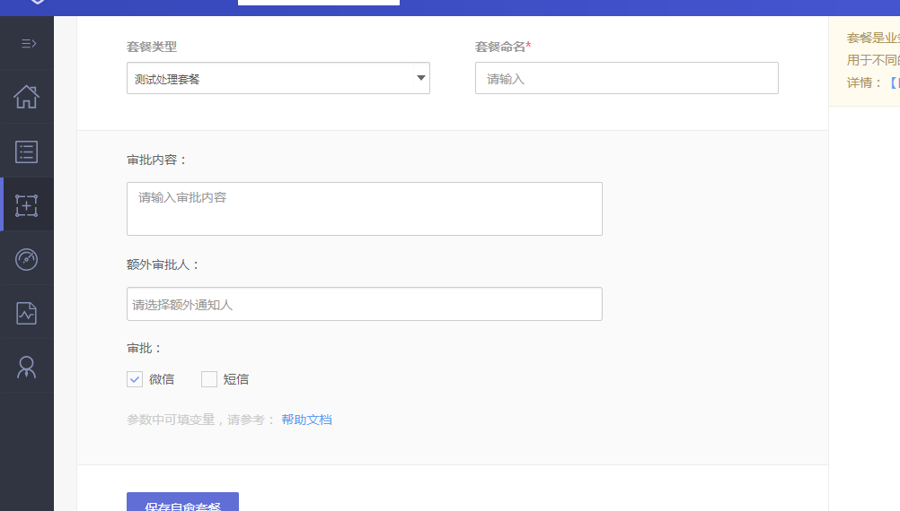

## 自定义处理套餐开发指引

### 1. WEB端开发流程
#### 1.1 给处理套餐命名

以下接入将以 **test** 作为处理套餐key，以 **测试处理套餐** 为名。

#### 1.2 添加告警源配置项 

配置文件路径：`${project_path}/fta_solutions_app/fta_std.py`

配置内容：以 **SOURCE_**开头的所有配置项
> **SOLUTION\_TYPE\_CHOICES：** 处理套餐源类型说明，用于DB记录和页面展示       
> **SOLUTION\_TYPE\_GROPS：** 告警套餐分组，用于页面展示  

修改代码如下图：



#### 1.3 告警套餐页面开发

##### 1.3.1 添加修改告警套餐页面的模版
在路径`${project_path}/templates/fta_solutions/solution_forms`下添加对应的模版文件，可以开发套餐处理所需要用户填写的表单参数。


启动服务，下图为套餐定义页面效果图：



### 2. FTA后台开发流程

所有的处理套餐都是继承 `BaseSolution` 如下
```python
from fta.solution.base import BaseSolution
``` 

#### 2.1 BaseSolution重要函数介绍

##### 基础部分

**run()函数** : 处理的入口函数，必须在子类中实现该方法，如果是同步处理套餐，可将处理逻辑在该函数中直接实现

```python
    def run(self):
        raise Exception('Should have run() method for Solution')

``` 
**set\_finished(self, result, comment, failure\_type=None)**: 标识任务执行完成

##### 回调函数
**wait\_polling\_callback** ：该函数可以实现异步任务API的请求轮询，直到API请求结果返回

**wait\_callback** :回调函数，可以在处理流程中实现重试等动作

#### 2.2 套餐开发示例
##### 2.2.1 基础处理套餐开发示例
在目录`/fta/project/solutions/`添加套餐处理文件，文件名需要与处理套餐的key一致，
实现方式如下：

```python
from fta.utils import logging
from fta.solution.base import BaseSolution

logger = logging.getLogger("solution")


class Solution(BaseSolution):
    """一个简易的测试"""

    def run(self):
        # TODO 实现套餐业务逻辑
        self.step1()

    def step1(self):
        
        logger.info("$%s &%s run step 1",
                    self.alarm_instance["id"], self.node_idx)
      	 return self.set_finished("success", u"执行测试套餐成功")   
      	                
```

##### 2.2.2 回调处理套餐开发示例
与同步处理套餐一样需要添加处理文件，命名与套餐的key一致。通过采用回调的方式，可以实现套餐处理的任务轮询和重试，实现代码示例如下(也可参考ijobs的套餐实现开发)。

```python
from fta.utils import logging
from fta.solution.base import BaseSolution

logger = logging.getLogger("solution")


class Solution(BaseSolution):
    """一个简易的测试"""

    def run(self):
        self.step1()
        self.wait_polling_callback(
            "step2", "http://127.0.0.1:8081/fta/status/gaze/")

    def step1(self):
        logger.info("$%s &%s run step 1",
                    self.alarm_instance["id"], self.node_idx)

    def step2(self, result):
        logger.info("$%s &%s run step 2: %s",
                    self.alarm_instance["id"], self.node_idx, result)
        import time
        time.sleep(10)
        self.wait_callback("step3", delta_seconds=10)

    def step3(self):
        logger.info("$%s &%s run step 3",
                    self.alarm_instance["id"], self.node_idx)
        return self.set_finished("success", u"执行测试套餐成功")
```


