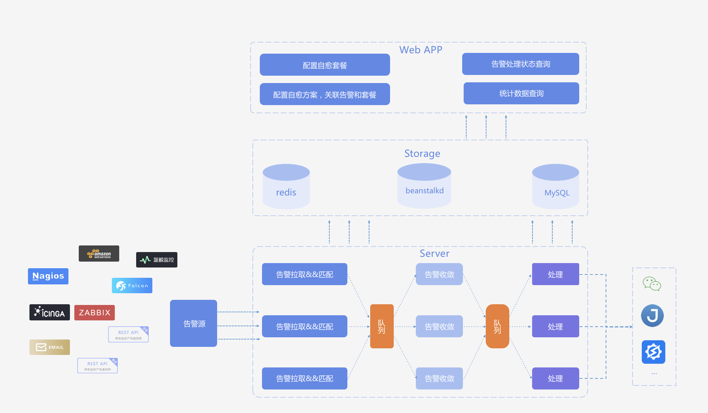

# 故障自愈的架构设计

故障自整体分为多层服务结构，主要是前端的Web层和后台的服务层，之间通过存储层进行数据交互：

1. **存储层(storage)**：提供系统所需的资源存储、消息队列以及缓存系统服务

2. **服务层(Server)**： 服务层分为三大模块

    1. **告警清洗模块**： 通过此模块我们可以将所有的告警格式统一，从中抽取核心信息组成后台可以识别的数据内容，并提交到队列。

    2. **告警收敛模块**： 通过此模块我们会根据收敛规则从多个维度对告警信息进行合并收敛，提取有效告警，降低告警频率。
    
    
    3. **告警处理模块**： 经过收敛后的有效告警会在这个模块进行处理，通过已经设定好的套餐，处理模块会通过蓝鲸企业服务总线(ESB)和其他系统进行交互，完成告警的自动恢复。

3. **Web层(Web APP)**： Web层是一个SaaS应用，通过它来提供Web服务。通过故障自愈提供的Web服务界面，用户可以进行资源的操作。