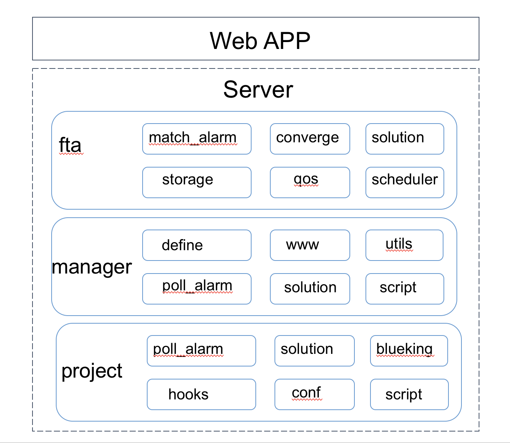

# 蓝鲸智云故障自愈的代码结构

> 故障自愈分为前端的Web层和后台的服务层两块

## Web层(Web APP)

它是一个SaaS应用，提供Web服务。

代码基本目录：`web_app/`

## 服务层(Server)

故障自愈后端服务。

1.代码（基本目录：`server/fta/`）

- fta：框架代码
- manager：逻辑代码
- project：业务代码
- requirements.txt：代码依赖
- constants.py：常量声明
- script/beanstalk_monitor.py：beanstalk 监控脚本
- script/update_cache_table.py：更新统计缓存
- settings_env.py：配置文件

2.支持文件（基本目录：`server/support-files/`）

- sql/0001_fta_20180727-1814_mysql.sql：数据库初始化文件

3.运行脚本（基本目录：`server/fta/bin/`）
- fta.sh：启停脚本（用法：./fta.sh --help）
