# 故障自愈 使用场景

- [1 基础场景](#1-基础场景)
    - [1.1 进程告警](#11-进程告警)
        - [1.1.1 编写拉起Nginx进程的作业](#111-编写拉起nginx进程的作业)
        - [1.1.2 创建拉起Nginx的自愈套餐](#112-创建拉起nginx的自愈套餐)
        - [1.1.3 接入自愈](#113-接入自愈)
    - [1.2 流量告警](#12-流量告警)
- [2 进阶场景](#2-进阶场景)    
    - [2.1 告警收敛](#21-告警收敛)
        - [2.1.1 设置全局收敛规则](#211-设置全局收敛规则)
            - [2.1.1.1 任意找一个业务设置收敛规则](#2111-任意找一个业务设置收敛规则)
            - [2.1.1.2 在Django后台修改生效范围](#2112-在django后台修改生效范围)
            - [2.1.1.3 在不同业务下测试，均生效](#2113-在不同业务下测试，均生效)
    - [2.2 健康诊断](#22-健康诊断)
        - [2.2.1 管理员可在Django后台调整健康诊断策略](#221-管理员可在django后台调整健康诊断策略)
    - [2.3 预警自愈](#23-预警自愈)
    - [2.4 组合套餐](#24-组合套餐)
        - [2.4.1 创建组合套餐](#241-创建组合套餐)
        - [2.4.2 组合套餐执行详情](#242-组合套餐执行详情)
    - [2.5 上下文传参](#25-上下文传参)
        - [2.5.1 使用场景](#251-使用场景)
            - [2.5.1.1 在作业平台中定义传递的参数](#2511-在作业平台中定义传递的参数)
            - [2.5.1.2 创建作业平台套餐](#2512-创建作业平台套餐)
            - [2.5.1.3 创建使用上一步输出参数的套餐](#2513-创建使用上一步输出参数的套餐)
            - [2.5.1.4 创建组合套餐](#2514-创建组合套餐)
        - [2.5.2 测试](#252-测试)
            - [2.5.2.1 作业间传参效果](#2521-作业间传参效果)
            - [2.5.2.2 作业 + 通知 组合套餐的输出结果](#2522-作业-通知-组合套餐的输出结果)
    - [2.6 套餐内置变量](#26-套餐内置变量)
        - [2.6.1 场景示例](#261-场景示例)
        - [2.6.2 可用变量](#262-可用变量)
            - [2.6.2.1 常规变量(可能为空)](#2621-常规变量可能为空)
            - [2.6.2.2 CMDB主机属性和-SET 属性的变量](#2622-cmdb主机属性和-set-属性的变量)
            - [2.6.2.3 CMDB变量支持五个参数](#2623-cmdb变量支持五个参数)
            - [2.6.2.4 故障机替换时备机](#2624-故障机替换时备机)
            - [2.6.2.5 常见用法](#2625-常见用法)
            - [2.6.2.6 注意事项](#2626-注意事项)
    - [2.7 收敛规则大全](#27-收敛规则大全)
        - [2.7.1 异常防御需审批](#271-异常防御需审批)
        - [2.7.2 触发通知](#272-触发通知)
        - [2.7.3 汇集相关事件](#273-汇集相关事件)
        - [2.7.4 收敛后处理](#274-收敛后处理)
        - [2.7.5 执行中跳过](#275-执行中跳过)
        - [2.7.6 执行中等待](#276-执行中等待)
        - [2.7.7 成功后跳过](#277-成功后跳过)
        - [2.7.8 成功后跳过，失败时审批](#278-成功后跳过失败时审批)
        - [2.7.9 超出后汇总](#279-超出后汇总)


# 1 基础场景

这里我们以运维常见的告警场景来介绍下如何接入故障自愈


## 1.1 进程告警

故障自愈除了能处理单机性能告警外，还能处理服务类的告警，比如进程告警。

比如nginx进程挂掉了，你需要拉起nginx进程。

（下面以Nginx进程告警接入自愈为例）

### 1.1.1 编写拉起Nginx进程的作业 

在作业平台编写拉起Nginx进程的脚本 (脚本中除了拉起进程，你还可以考虑增加进程检测的逻辑，保证拉起进程这个过程无误)

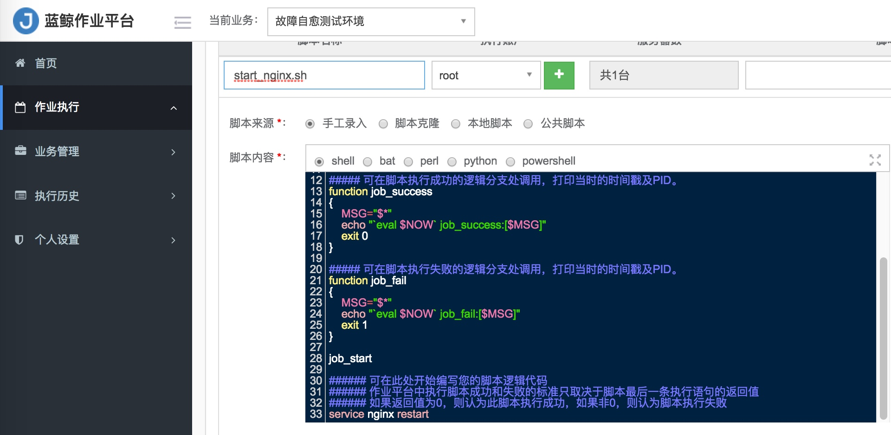


### 1.1.2 创建拉起Nginx的自愈套餐


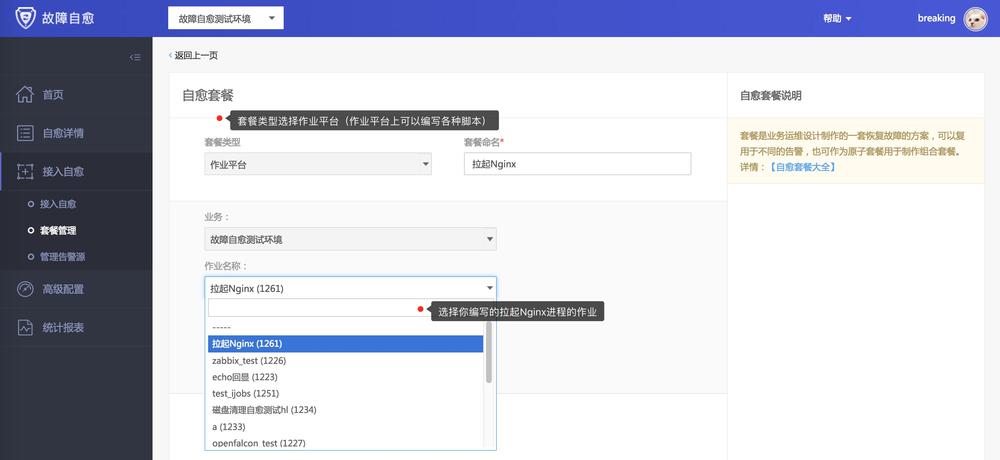


### 1.1.3 接入自愈

在接入自愈页面将进程告警关联拉起Nginx套餐，自愈范围选中nginx模块

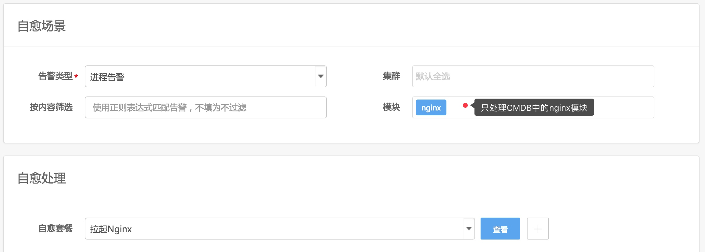


（`集群`、`模块`筛选用于相同告警类型，不同模块的处理方式不一样。）


## 1.2 流量告警

网卡出现流量告警，你也需要去关注，去分析是哪些服务占用了如此大的带宽，为了保证不影响整体服务，是否需要限流

当前故障自愈支持`外网出带宽`、`内网出带宽`、`外网入带宽`、`内网入带宽`等网络流量的告警接入。 

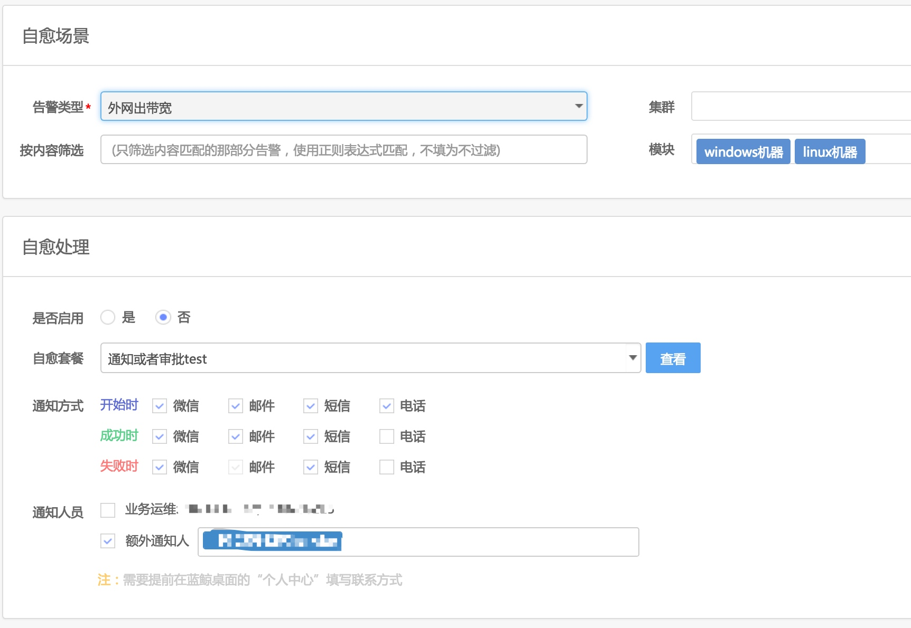


# 2 进阶场景

当你对基础场景非常熟悉后，可以挑战进阶场景来完成复杂场景的故障自愈。

## 2.1 告警收敛

我们很有可能收到重复的告警，所以故障自愈推出告警收敛功能。

满足一定规则后，执行对应的收敛方式。

点击右上角 新建收敛规则，按下图灰色框中内容添加一条规则。


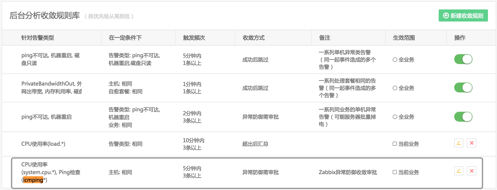

下图中命中了上述最后一条规则（在同一台主机上，5分钟内出现3条以上告警，由于没有进行审批动作，于是20分钟后超时了）。 

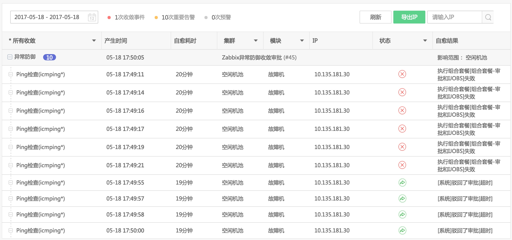


### 2.1.1 设置全局收敛规则

默认手动添加的收敛规则的生效范围是`当前业务`，如果希望在全业务下都生效，可以在Django后台设置。

#### 2.1.1.1 任意找一个业务设置收敛规则

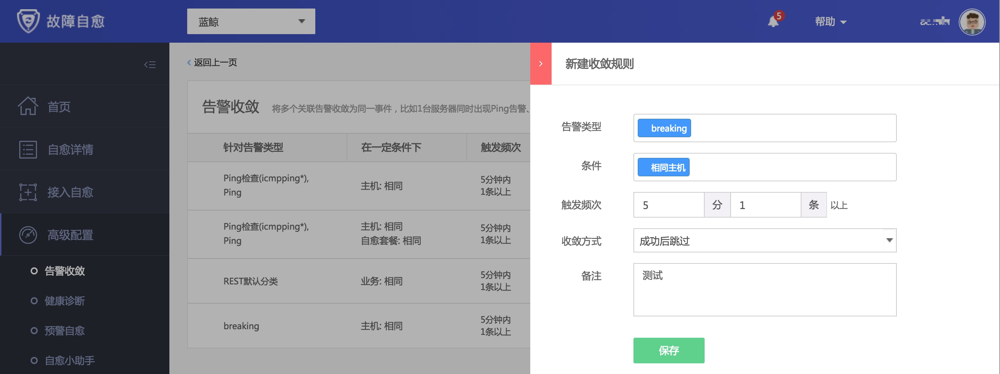


#### 2.1.1.2 在Django后台修改生效范围

使用管理员角色访问以下地址

http://${PaaS_URL}/o/bk_fta_solutions/admin/fta_solutions_app/incidentdef/

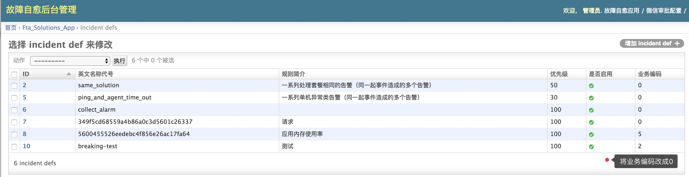

找到刚添加的收敛规则，将其业务编码修改为0 （即对所有业务生效.）

访问`告警收敛`可以发现 `规则来源` 从 `当前业务` 换成了 `系统内置`

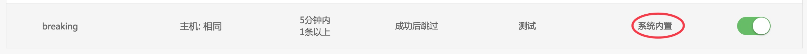

#### 2.1.1.3 在不同业务下测试，均生效

在A业务下测试收敛规则
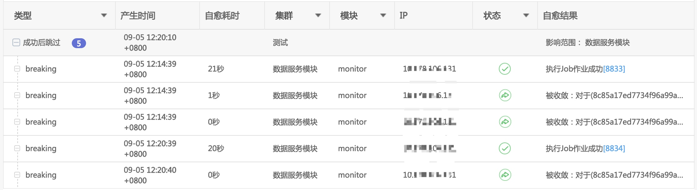

在B业务下测试收敛规则
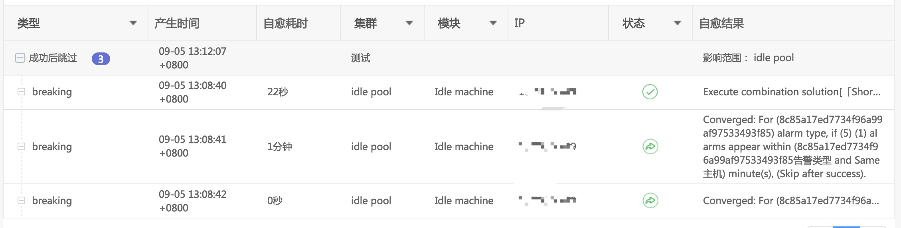


## 2.2 健康诊断

如果某一些服务器经常出现告警，故障自愈会自动回溯这些告警，并作出诊断，提前帮企业发现风险

> 健康诊断的规则基于腾讯处理告警的经验

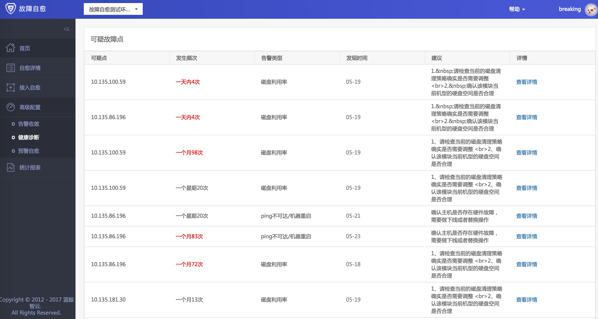

### 2.2.1 管理员可在Django后台调整健康诊断策略

用PaaS管理员访问${PaaS_URL}/o/bk_fta_solutions/admin/，进入后台 

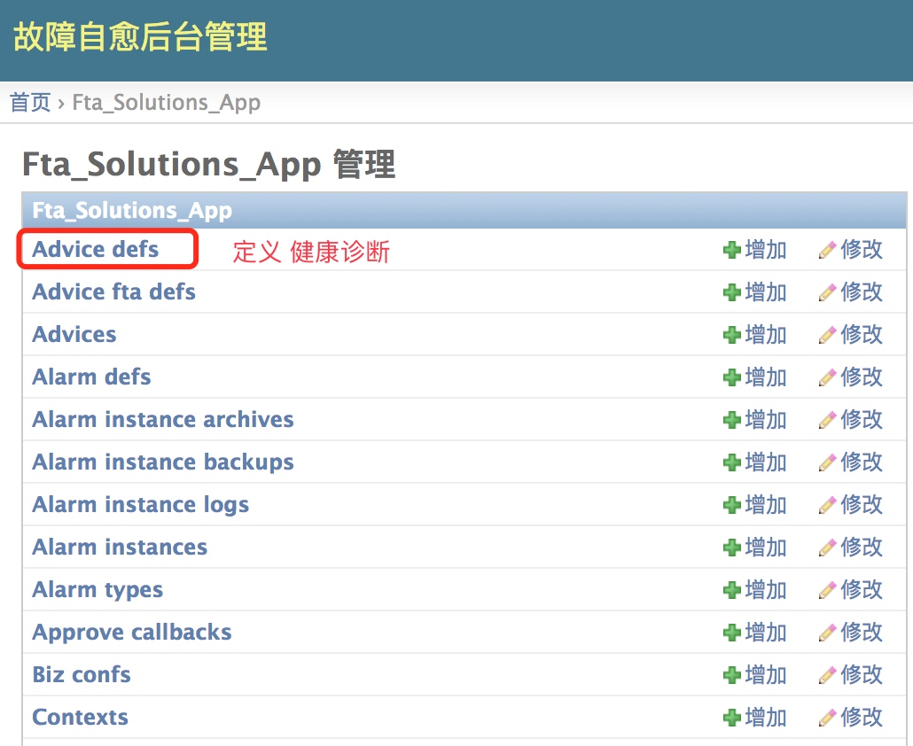

点击`Advice_defs`进入健康诊断策略配置页面

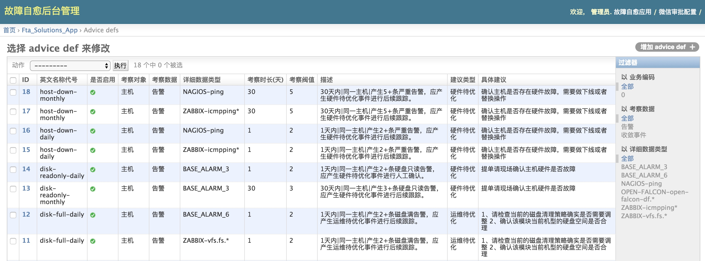


## 2.3 预警自愈

预警自愈是健康诊断的一个延伸功能，会回溯最近发生异常告警事件，通过自愈方案提前帮你解决风险，在“高级设置”菜单下即可找到。

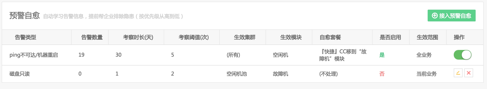


故障自愈默认开启了一个预警自愈套餐（空闲机模块下同一台主机，30天内出现5次`PING不可达`或`机器重启`告警，则把此主机移动到`故障机`模块下）

预警自愈为每天早上8:00做自愈的回溯分析，而后执行预警自愈操作

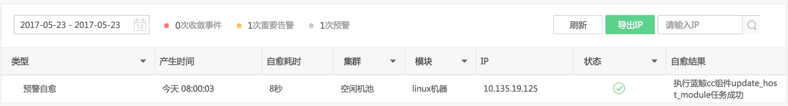


## 2.4 组合套餐

把故障自愈该业务下的套餐和官方通用套餐组合起来使用。

组合套餐的配置其实就是维护一棵二叉树。

节点的左节点表示成功的后续套餐，右节点表示失败的后续套餐。


### 2.4.1 创建组合套餐

创建组合套餐的前置步骤：准备好组合套餐中每个原子（节点）的套餐.

然后创建组合套餐 

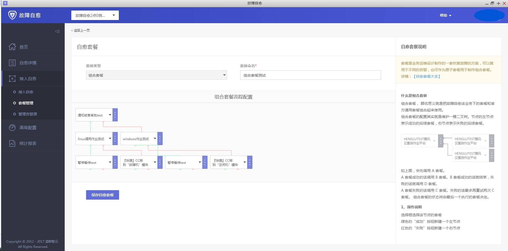

### 2.4.2 组合套餐执行详情

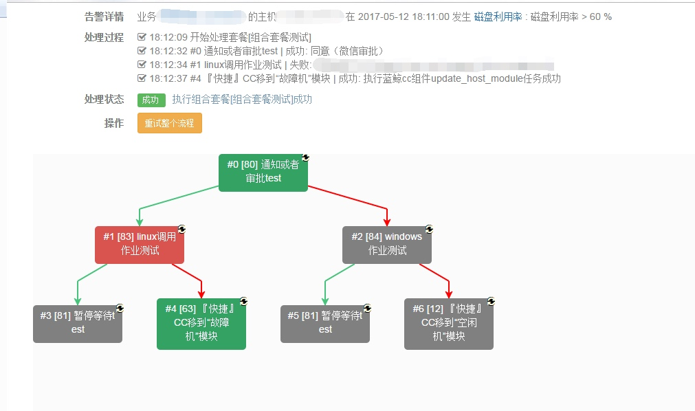

利用组合套餐你可以实现更多复杂的运维场景。


## 2.5 上下文传参

上下文传参一般用于组合套餐中，将上一个节点的输出作为下一个节点的输入。

> 目前支持将作业平台套餐的输出作为任意下一个节点(作业平台、通知、标准运维等)的输入。

### 2.5.1 使用场景

故障自愈的默认套餐`『快捷』发送CPU使用率TOP10的进程(微信)`、`『快捷』发送内存使用率TOP10的进程(微信)` 实际上是一个使用上下文传参的组合套餐。

* 第1步：创建输出CPU、内存使用率的TOP10的作业

* 第2步：创建作业平台套餐

* 第3步：创建`通知`套餐，引用上一步输出的结果，以微信的方式发送出来

* 第4步：使用组合套餐，将两个套餐串起来

### 2.5.1.1 在作业平台中定义传递的参数

在作业平台的作业中按照如下格式将传递的参数定义好

```
  echo "FTAARGV 变量:值"
```

以`『快捷』发送内存使用率TOP10的进程(微信) `套餐中的第1步的脚本为例：
```
#!/bin/bash
#         USAGE: ./get_top_proc_mem.sh <cpu|mem> <number># 
#   DESCRIPTION: 输出系统当前占用资源（cpu、内存）最多的TopN进程
#===================================================================
set -o nounset                              # Treat unset variables as an error

fields="pcpu,pmem,comm"

usage() {
    cat <<EOF
    get_top_proc_in_oneline.sh <cpu|mem> <number of top proc>
EOF
    exit 1
}

join() {
    local IFS="$1"
    shift; echo "$*"
}

if (( $# < 1 )) || (( $# > 2 )) ; then
    usage
fi

case $1 in 
    cpu) sort_field=pcpu ;;
    mem) sort_field=rss ;;
    *) usage ;;
esac

if [[ $# -eq 2 ]]; then
    top_n=$2
else
    top_n=6
fi

return_mem=$(ps -eo "$fields" --sort=-"$sort_field" | head -$(( top_n + 1 )) | awk 'NR==1 { gsub(/%/,"") } {printf "%s\\n", $0 }')

echo "FTAARGV return_mem:${return_mem}"
```

> 上面示例中，return_mem为传递给下一个原子节点的变量，${return_mem}为变量的值.

创建输出传参（传递给下一个步骤的参数）的作业


### 2.5.1.2 创建作业平台套餐

创建自愈套餐，套餐类型选择作业平台，选择上一步创建的作，并勾选`从作业中获取参数`

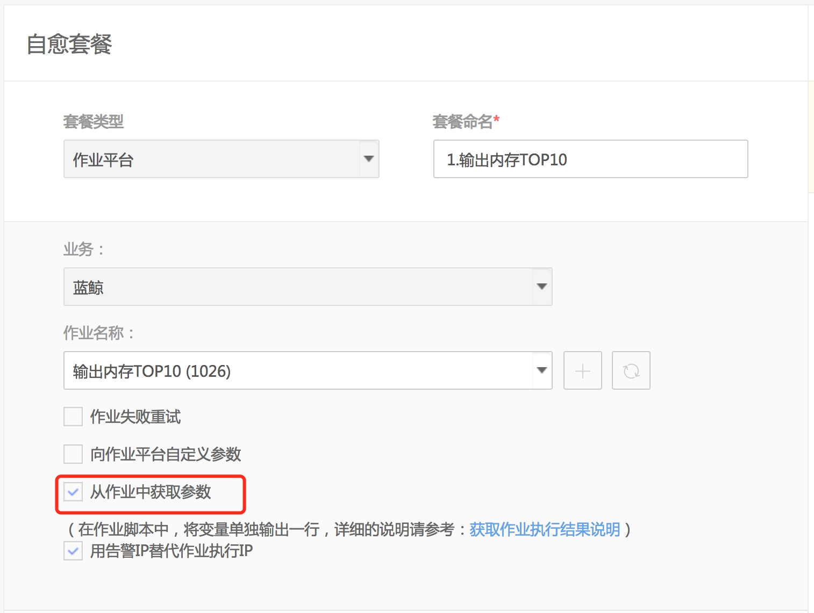

### 2.5.1.3 创建使用上一步输出参数的套餐

创建通知套餐或作业平台套餐来使用上一步输出的参数。

> 如果你没配置通知套餐，也可以通过作业平台套餐来测试.

创建通知套餐，引用上一步输出的参数

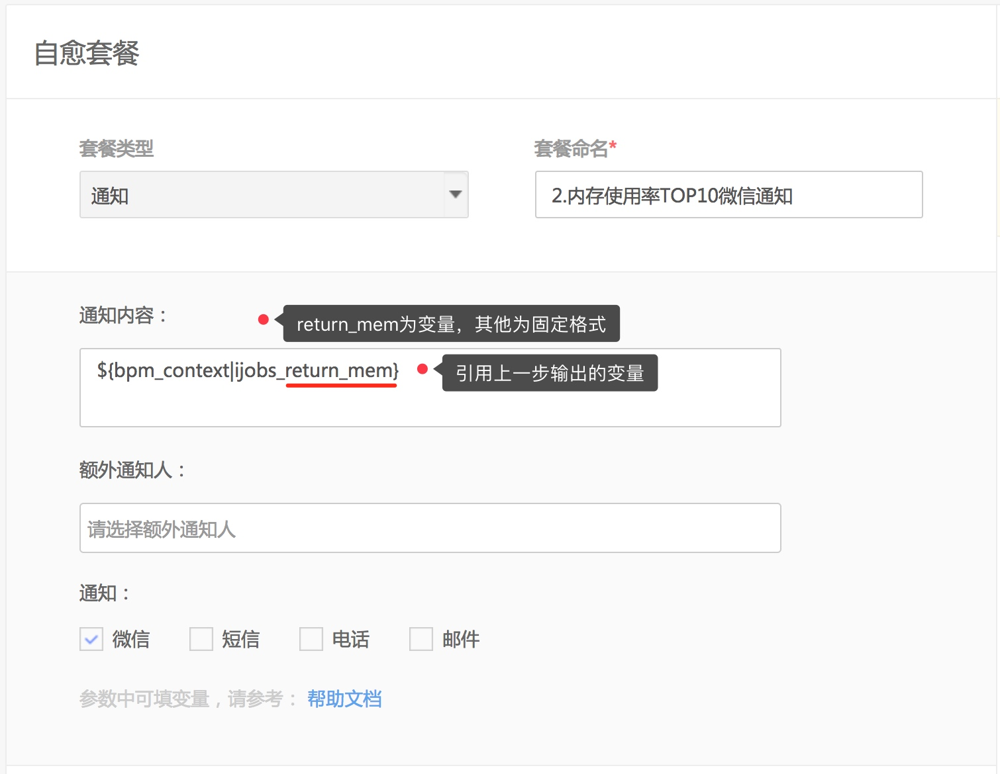

创建作业，引用作业平台套餐传递的参数

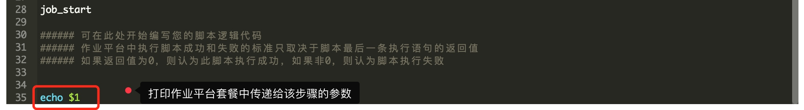

创建作业平台套餐，引用上一步输出的参数

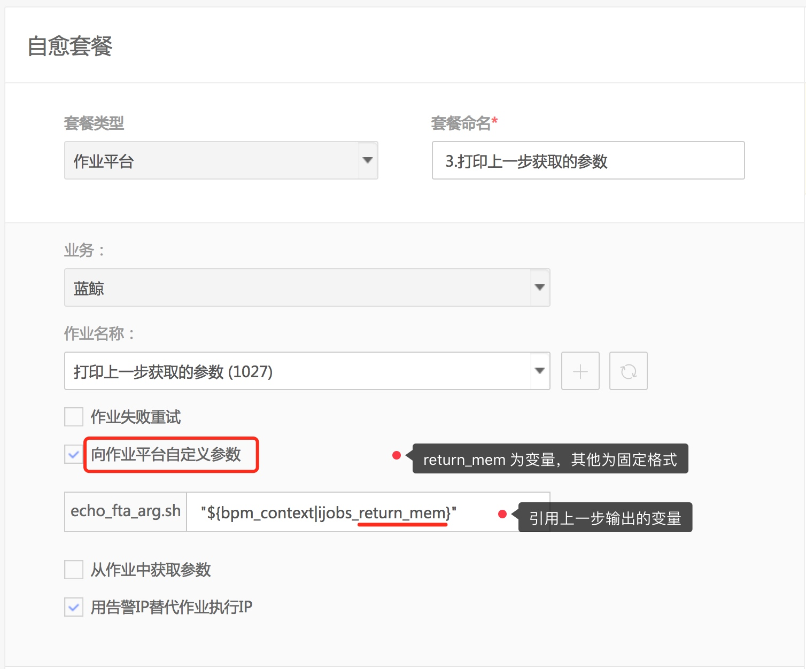


### 2.5.1.4 创建组合套餐

通过组合套餐，将输出参数 和 使用参数 的原子套餐串起来。

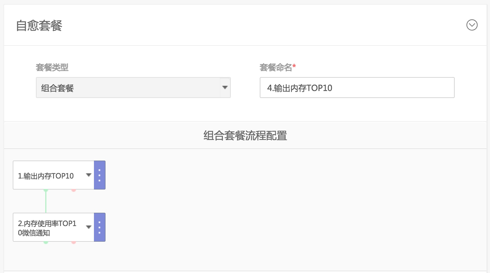

## 2.5.2 测试

### 2.5.2.1 作业间传参效果

模拟自愈，执行上一步创建的组合套餐（包含上下文传参特性）

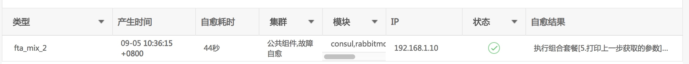

执行详情

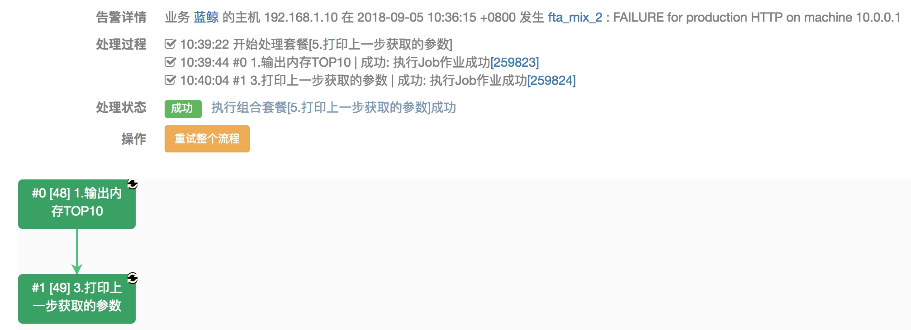

\#0 步 输出参数

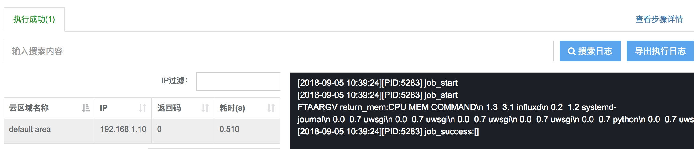

\#1 步 获取参数

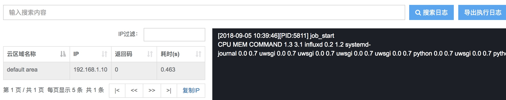

\#1 步 作业执行时传递参数内容

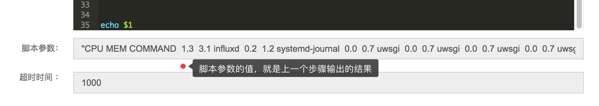

### 2.5.2.2 作业 + 通知 组合套餐的输出结果

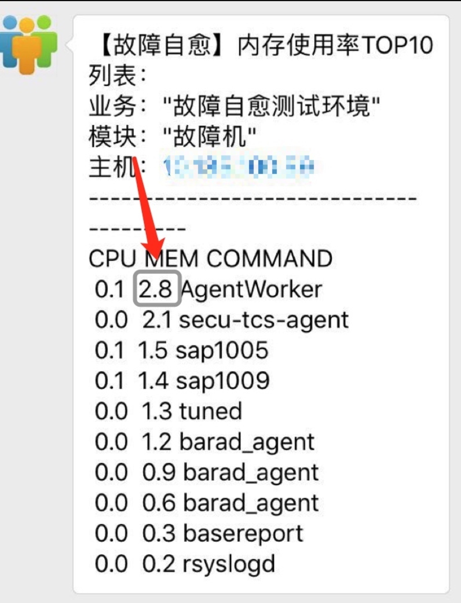


## 2.6 套餐内置变量

自愈的很多套餐里都需要传入参数，但有些参数是套餐执行时根据故障机信息进行动态获取的。

目前自愈里很多套餐类型都支持了这种变量参数，比如通知审批等。


### 2.6.1 场景示例

B机器是VMM的管理端，A机器是VMM中的应用服务器。当A机器上发生告警时，可以通过调用B机器上管理端的接口来完成自愈

在套餐中引用变量

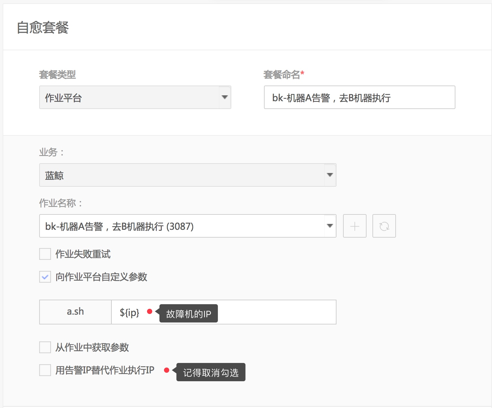

### 2.6.2 可用变量

#### 2.6.2.1 常规变量(可能为空)

* ${ip}：告警的IP
* ${raw}：告警的字符内容
* ${alarm_type}：告警类型
* ${source_time}：告警时间(格式如 2014-01-01)
* ${cc_biz_id}：CMDB的业务ID
* ${operator}：业务负责人的第一个

#### 2.6.2.2 CMDB主机属性和 SET 属性的变量

格式为：${cc|属性名字}，如：

* ${cc|OuterIP}：故障主机的外网 IP
* ${cc|AssetID}：故障主机的固资编号 具体属性名请在 CMDB 上查询。


#### 2.6.2.3 CMDB变量支持五个参数

all、set、custom、alarm_ci_name、ip_bak
all：当有多个参数的时候，将返回通过逗号间隔的字符串。如有多个主机名称的时候

* ${cc|HostName|all}：返回"hostname1,hostname2,hostnameN"，不添加默认返回第一个 set：查询 Set 属性。如

* ${cc|SetName|set}：故障主机的Set名称 custom：查询自定义属性。如查询一个名为 IDC 的 Set 属性

* ${cc|IDC|set|custom}

* alarm\_ci\_name：指定查询故障机的CMDB属性

* ip_bak：指定查询备机的CMDB属性

三个参数能任意组合，如以下两个写法是等价的：

${cc|IDC|set|custom|all}

${cc|IDC|all|set|custom}


#### 2.6.2.4 故障机替换时备机

故障自愈现在有两种获取备机的 IP，通过获取备机套餐在 CC 中寻找符合要求的机器或者通过作业平台脚本来获取。获取到的备机参数为：${bpm_context|ip_bak}

与 IP 有关的变量有三个：

* ${ip} 当前流程处理的 IP，默认是故障机 IP，可以被替换操作对象的套餐改为备机 IP

* ${bpm\_context|ip\_bak} 备机 IP

* ${bpm\_context|alarm\_ci\_name} 故障机 IP

#### 2.6.2.5 常见用法

* 根据告警传入告警IP
${ip}

* 根据告警IP传入外网IP
${cc|OuterIP}

* 根据告警IP传入自定义主机属性
${cc|gametype|custom}

* 根据告警IP传入set名称
${cc|SetName|set}

* 根据告警IP传入自定义set属性
${cc|openstate|set|custom}

* 跟进告警IP传入组合属性(如：1区_虎啸谷)
${cc|SetWorldID|set}\_${cc|SetChnName|set}

#### 2.6.2.6 注意事项
所有的变量都是区分大小写的，清注意大小写。


## 2.7 收敛规则大全

介绍自愈目前收敛的几种模式，并用现有的一些通用收敛规则举例说明其用法。 希望收敛规则能满足你各式各样的需求，并且在配置好后，让你会忘了它的存在。

### 2.7.1 异常防御需审批

触发规则后，会打电话通知用户，让用户审批决定是否收敛。 如果超时未审批则会收敛跳过，不处理。 如果 30 分钟内发生相同规则的异常防御事件，会被汇集到同一个收敛事件中。

可用于防御大规模告警的异常，如发布未屏蔽，网络问题，机房故障等等。通过人工判断大量的告警是否需要处理。

* #13 一系列同业务的进程端口告警(可能发布变更未屏蔽):

同业务5分钟内出现 3 条以上进程端口则认为是异常事件需要审批(默认不开启)

* #14 一系列同机房的单机异常告警:

同机房 2 分钟内出现 10 条以上的 ping/agent/restart 告警则认为是异常事件需要审批

* #15 一系列同业务的单机异常告警:

同业务2分钟内出现 3 条以上的 ping/agent/restart 告警则认为是异常事件需要审批

### 2.7.2 触发通知

触发规则后，不影响处理，发送通知。

可用于配置阀值告知。

### 2.7.3 汇集相关事件

触发规则后，不影响处理，只是把满足收敛规则的告警汇集在一起展示为同一个事件。

在界面上把相关的告警汇集在一起展示，能更好自定义告警间的关联性。

* #9 掉线可能因为大区内基础告警:

对于在线告警，汇总相同大区内的基础告警

* #18 归纳同主机的一系列告警:

汇总相同主机 5 分钟内出现的告警

* #20 归纳同主机的一系列进程端口告警:

汇总相同主机 30 分钟内出现的进程端口告警

### 2.7.4 收敛后处理

与其他收敛规则相反。未触发规则时，配置的告警类型不处理。触发规则后，才开始处理。

可以等告警数量超过一定阀值后才处理告警。 或者一定时间内同时出现 A 告警和 B 告警的时候再开始处理。

### 2.7.5 执行中跳过

触发规则后，如果有满足规则的其他告警正在自愈，或刚结束自愈 5 分钟，则跳过当前告警。

可用于避免重复处理。

* #12 Ping/Agent 引发的一系列告警:

对于由 ping/agent 告警引发的上层告警，如果 ping/agent 告警在处理中，则收敛

### 2.7.6 执行中等待

触发规则后，如果有满足规则的其他告警正在自愈，则等其他告警自愈完成后再继续处理当前告警。

可用户互斥的告警处理，或有先后顺序依赖的告警处理。

### 2.7.7 成功后跳过

触发规则后，如果有满足规则的其他告警自愈成功，则跳过当前告警。失败的话则继续自愈处理。

可用于实现失败重试。

* #2 一系列单机异常类告警:

对于相同主机的[ping超时,上报超时,系统重启,磁盘只读]告警，5 分钟内出现过且自愈成功则收敛

* #5 一系列处理套餐相同的告警:

对于相同主机相同处理的告警，5 分钟内出现过且自愈成功则收敛

### 2.7.8 成功后跳过，失败时审批

触发规则后，如果有满足规则的其他告警自愈成功，则跳过当前告警。 失败的话则发送审批由用户判断是否继续执行自愈处理。

### 2.7.9 超出后汇总

触发规则后，超出数量的告警将会收敛不处理，并发送汇总通知

如果告警在一定时间内不断出现，超过某个阀值可以认为其有异常，不再自愈，触发通知。


